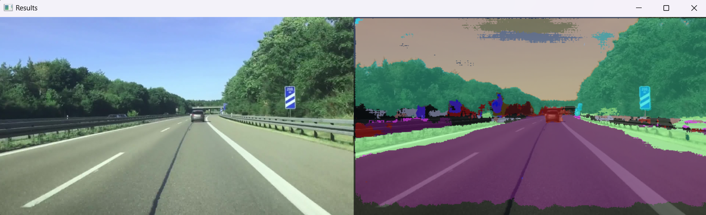

# Semantic Segmentation using ENet Neural Network

This project performs **semantic segmentation** on both images and videos using the **ENet** architecture, a lightweight deep learning model designed for real-time applications. It classifies each pixel of an input into predefined categories, producing detailed segmentation maps.  

---

## Table of Contents

- [Introduction](#introduction)  
- [Features](#features)  
- [Requirements](#requirements)  
- [Usage](#usage)  
  - [Image Segmentation](#image-segmentation)  
  - [Video Segmentation](#video-segmentation)  
- [Results](#results)  

---

## Introduction

Semantic segmentation is a fundamental task in computer vision, where each pixel is assigned a class label. This project extends ENet’s efficiency to both static images and videos, enabling real-time segmentation of visual data. Video segmentation is achieved by processing each video frame individually and then recombining them to recreate the segmented video.  

---

## Features

- Lightweight and efficient ENet architecture.  
- Supports both **image segmentation** and **video segmentation**.  
- Pixel-wise classification with a color-coded output mask.  
- Overlay of segmentation results on the original images/videos.  
- Visual legend displaying class names and corresponding colors.  

---

## Requirements

To run this project, ensure the following are installed:  

- **Python 3.6 or later**  
- Python Libraries:  
  - `OpenCV`  
  - `NumPy`  
  - `imutils`  
- Pre-trained ENet model and metadata files:  
  - `enet-model.net`: Pre-trained model weights.  
  - `enet-classes.txt`: Class names file.  
  - `enet-colors.txt`: RGB color mappings for the classes.  


## Usage

### Image Segmentation

1. Place the target image in the `./test/` directory.  
2. Update the `ORIG_IMG_FILE` variable in `ss-img.py` with the image filename.  
3. Run the script:  
   ```bash
   python ss-img.py


### Video Segmentation

1. Place the target video in the `./test/` directory.  
2. Update the `ORIG_IMG_FILE` variable in `ss-vid.py` with the image filename.  
3. Run the script:  
   ```bash
   python ss-vid.py
4. Result video is stored in the root folder. 

## Results

Here are some sample results from the segmentation:

### Image Segmentation




### Video Segmentation
https://youtu.be/OkfR1oddNaU


